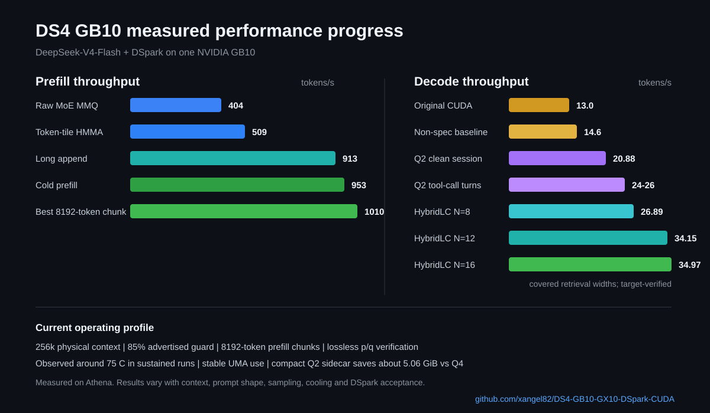

# DS4 GB10/GX10 DSpark CUDA

Run DeepSeek-V4-Flash with lossless DSpark speculative decoding on one NVIDIA
GB10/GX10. This fork of [antirez/ds4](https://github.com/antirez/ds4) is tuned
for long-context coding and agent workloads, with exact sparse attention,
GPU-side verification and reproducible GB10 benchmarks.

Repository:
[xangel82/DS4-GB10-GX10-DSpark-CUDA](https://github.com/xangel82/DS4-GB10-GX10-DSpark-CUDA)

## Results at a glance

Measured on Athena, a single NVIDIA GB10, using the recommended
DeepSeek-V4-Flash Q2/imatrix target:

| Workload | Measured result |
| --- | ---: |
| Short and medium prefill | 900-953 t/s average |
| Best complete 8192-token chunk | 1009.78 t/s |
| Long append, 27.7k to 95.1k context | 913.15 t/s |
| Deep append, 127.8k to 180.8k context | 836.16 t/s |
| DSpark tool-call decode | commonly 24-26 t/s |
| HybridLC covered decode | up to 34.97 t/s, approximately 35 t/s |
| HybridLC retrieval acceptance | 70.68%, 1022 / 1446 draft tokens |
| Clean mixed coding session with compact Q2 sidecar | 20.88 t/s weighted |
| Physical context enabled by default | 262144 tokens |
| Experimental physical context | 1M tokens |
| Sustained GB10 temperature observed in long runs | about 75 C |
| Memory behavior with the compact Q2 sidecar | stable, about 5.06 GiB less than Q4 |

The original CUDA path measured about 13 decode t/s on the same machine.
Decode varies with prompt, sampling and DSpark acceptance. Prefill averages are
also affected by short final chunks, so the table reports both request-level
results and the best complete chunk. The temperature is an operational
observation from Athena rather than a controlled thermal benchmark; ambient
temperature, cooling, clocks and workload can change it. Long test sessions did
not show progressive memory growth, and the compact Q2 sidecar provides about
5.06 GiB more UMA headroom than Q4.

The 35 t/s result is not a fixed request-wide rate. Repetitive code, tool
protocols and structured output provide more reusable suffixes and benefit the
most; novel free-form text falls back naturally to neural DSpark. In the
measured long final answer, retrieval covered only 6.1% of cycles and cumulative
decode was 16.37 t/s. No approximate token is committed: both paths preserve
the target sampling distribution.

The current release combines the compact Q2 DSpark and lossless HybridLC work
validated on 26 July 2026 with the exact fused-D2R dispatch fix validated on
27 July 2026. Q2 remains the default sidecar and HybridLC remains
target-verified; the D2R fix only corrects the logical scratch span passed by
the shared prefill arena. It does not change weights, routing, kernels,
sampling, verifier behavior or persistent memory.



## What this fork adds

This list is intentionally limited to work added by this fork. The imported
Entrpi/ds4 CUDA prefill foundation is documented separately in
[License and attribution](#license-and-attribution) and is not presented as a
fork addition here.

### Additions made on top of Entrpi/ds4

The fast CUDA prefill path is built on
[Entrpi/ds4](https://github.com/Entrpi/ds4), not reimplemented independently.
The table distinguishes that imported foundation from the work subsequently
added in this fork:

| Entrpi/ds4 foundation used here | Added or substantially adapted in this fork |
| --- | --- |
| Routed-MoE D2R/MMQ tiers, aligned-SoA repack and DS4 MMQ adapters | Single-pass fused gate/up, token-bound stream-K scheduling, fused HC/RMS/RoPE/MoE epilogues, tail-aware dispatch and runtime numerical self-tests |
| Token-tile HMMA prefill attention | Native SM121a MXFP4 indexer scoring, shape-specific exact Top-512 dispatch and the dynamic direct-F16 path beyond the earlier 131k boundary |
| llama.cpp MMQ kernels vendored through the Entrpi integration | In-process GB10 model preparation and the memory, long-context, benchmarking and profiling integration required by this session-oriented DSpark server |

The DSpark sidecar, lossless p/q verifier, HybridLC, canonical KV/frontier
handling and multi-context launch profiles are separate additions of this fork;
they are not claimed as part of the imported Entrpi prefill stack.

- DeepSeek-V4-Flash DSpark GGUF sidecar conversion and loading.
- Lossless DSpark speculative decoding with GPU-side p/q rejection sampling.
- Lossless HybridLC suffix retrieval with Block Verification and exact residual
  correction.
- Native SM121a MXFP4 indexer scoring and shape-specific exact Top-512
  dispatch.
- Single-pass fused gate/up with token-bound stream-K, plus fused
  HC/RMS/RoPE/MoE epilogues and runtime parity self-tests.
- Dynamic direct-F16 sparse attention beyond the earlier 131k fast-path
  boundary.
- Canonical KV checkpoints and frontier reuse for append-only chat and
  tool-call workloads.
- Pipelined model upload, compact Q2 DSpark packaging and release of copied
  GGUF pages.
- GB10 memory profiles, 256k and experimental 1M launchers, reproducible CUDA
  regressions, benchmark scripts and Nsight instrumentation.

The target model remains authoritative. DSpark drafts are accepted with
`min(1, p(x) / q(x))`; rejected drafts are replaced from the positive residual
`max(p-q, 0)`. This preserves the target sampling distribution rather than
using a lossy exact-match shortcut.

## Choose the DSpark sidecar

The target model is identical in both profiles. Only the three-block DSpark
drafter changes:

| Variant | Routed experts | Size | Best for |
| --- | --- | ---: | --- |
| `q2` | IQ2_XXS gate/up, Q2_K down | about 5.64 GiB | Recommended default, about 5.06 GiB more UMA headroom |
| `q4` | Q4_K gate/up/down | about 10.70 GiB | Optional conservative profile for acceptance comparisons |

The validated compact Q2 run completed 15 direct requests, generated 7866
tokens and averaged 20.88 decode t/s. Tool-call turns reached 24-26 t/s and a
3311-token final analysis ran at 17.40 t/s. Its output passed manual coherence
and completeness review. Q2 makes the drafter faster, about 15.28 ms in that
run, but acceptance remains workload-dependent; Q4 therefore stays the
comparison profile while Q2 is the installation default.

The default launcher selects Q2:

```bash
./run-dspark-server.sh
```

Select Q4 without replacing the Q2 file:

```bash
DS4_DSPARK_VARIANT=q4 ./run-dspark-server.sh
```

## Performance progress

The major measured milestones on the same GB10 were:

| Milestone | Prefill | Decode |
| --- | ---: | ---: |
| Original CUDA path | - | about 13 t/s |
| Raw-GGUF routed-MoE MMQ | 404.46 t/s | 23.00 t/s at 83k |
| Token-tile HMMA attention | 509.14 t/s | unchanged |
| Fused HC/RMS/RoPE/MoE pipeline | 902-953 t/s | commonly 23-26 t/s on tool turns |
| Lossless HybridLC (`98c71c0`) | 851-907 t/s append | 26.89-34.97 t/s on covered retrieval widths |
| Direct-F16 sparse attention beyond 131k | 836.16 t/s at 127.8k-180.8k | 19.89 t/s after 180.8k |
| Shared-arena fused-D2R fix (`fb11333`) | 1001.94 t/s at 0-8k, 1006.61 t/s at 8k-16k | DSpark verifier unchanged |

The HMMA transition improved a position-matched 57,344-token interval by
25.88%. The direct-F16 capacity fix improved the measured deep append by
33.80% and removed the artificial performance cliff beyond 131k without
adding a score matrix or persistent F32 KV mirror. The fused-D2R fix recovered
4.27% on the first 8192-token block by passing the arena's logical gate segment
to the overlap guard instead of its full 1920 MiB owner capacity. Greedy hashes
were unchanged, CUDA parity remained bit-exact and no persistent allocation was
added.

Detailed profiler reports, rejected experiments, numerical tolerances and
rollback history, including the complete HybridLC validation, are maintained in
[README-GB10.md](README-GB10.md).

## Install on GB10/GX10

The commands below assume a GB10/GX10 Linux host with CUDA installed at
`/usr/local/cuda`. The `/home/athena` paths shown below reproduce the measured
machine, but they are examples rather than requirements. The installer defaults
to `$HOME/ds4` for models and can itself run from any checkout directory.

Requirements:

- one NVIDIA GB10/GX10 with 128 GB unified memory;
- a CUDA 13 toolchain capable of compiling `sm_121a`;
- enough disk space for the 80.76 GiB target, one or both DSpark sidecars,
  the temporary Hugging Face shards and the configured KV disk cache;
- Linux build tools, Git, Python 3, `wget`, `curl` and `rsync`.

Recommended layout:

```text
~/DS4-GB10-GX10-DSpark-CUDA   # source checkout
~/ds4                         # target, sidecars and logs
/tmp/ds4-gb10-dspark-kv       # disposable KV disk cache, default 16 GiB budget
```

### Automatic installation

For a fresh machine, clone the repository and let the installer download the
target, fetch the official DSpark shards, build both sidecars, run the CUDA
regression and compile the server:

```bash
cd "$HOME" && git clone https://github.com/xangel82/DS4-GB10-GX10-DSpark-CUDA.git && cd "$HOME/DS4-GB10-GX10-DSpark-CUDA" && ./install-gb10.sh --install-deps --dspark both
```

To save disk and conversion time, build only the desired sidecar:

```bash
./install-gb10.sh --install-deps --dspark q4
./install-gb10.sh --install-deps --dspark q2
```

Downloads are resumable and existing GGUF files are reused. Run with
`--force-sidecar` only when an existing sidecar must be regenerated. The
installer stops before the CUDA regression if another `ds4-server` process is
active, protecting unified-memory headroom.

Preview paths and planned work without downloading:

```bash
./install-gb10.sh --dspark both --dry-run
```

Use a different model location:

```bash
./install-gb10.sh --dspark q2 --model-dir /mnt/models/ds4
DS4_MODEL_DIR=/mnt/models/ds4 ./run-dspark-server.sh
```

The checkout path is also free: clone the repository anywhere and run
`install-gb10.sh` from that checkout. For still finer control,
`DS4_DSPARK_HF_DIR`, `DS4_DSPARK_GGUF`, `DS4_MODEL` and
`DS4_DSPARK_MODEL` override the individual paths.

The following sections show the same procedure step by step.

### 1. Install tools and clone

```bash
sudo apt update && sudo apt install -y build-essential git curl wget rsync python3
cd "$HOME" && git clone https://github.com/xangel82/DS4-GB10-GX10-DSpark-CUDA.git
```

For an existing clean checkout:

```bash
cd "$HOME/DS4-GB10-GX10-DSpark-CUDA" && git fetch origin && git pull --ff-only origin main
```

### 2. Download the target model

Create the persistent model directory and download the recommended
DeepSeek-V4-Flash Q2/imatrix target:

```bash
mkdir -p "$HOME/ds4" && cd "$HOME/DS4-GB10-GX10-DSpark-CUDA" && DS4_GGUF_DIR="$HOME/ds4" ./download_model.sh q2-imatrix
ln -sfn "$HOME/ds4/DeepSeek-V4-Flash-IQ2XXS-w2Q2K-AProjQ8-SExpQ8-OutQ8-chat-v2-imatrix.gguf" "$HOME/ds4/ds4flash.gguf"
```

To use another compatible target, point `DS4_MODEL` to its GGUF instead of
creating the symlink.

### 3. Download the DSpark source shards

Only the index and the three shards containing the official
DeepSeek-V4-Flash-DSpark module are required:

```bash
mkdir -p "$HOME/ds4/dspark-v4flash-hf" && cd "$HOME/ds4/dspark-v4flash-hf" && for f in config.json model.safetensors.index.json model-00046-of-00048.safetensors model-00047-of-00048.safetensors model-00048-of-00048.safetensors; do wget -c "https://huggingface.co/deepseek-ai/DeepSeek-V4-Flash-DSpark/resolve/main/$f" || exit 1; done
```

### 4. Build a sidecar

Build the optional Q4 sidecar:

```bash
cd "$HOME/DS4-GB10-GX10-DSpark-CUDA" && DS4_DSPARK_VARIANT=q4 ./build-dspark-sidecar.sh 2>&1 | tee "$HOME/ds4/ds4-dspark-q4-convert.log"
```

Build the recommended Q2 sidecar:

```bash
cd "$HOME/DS4-GB10-GX10-DSpark-CUDA" && DS4_DSPARK_VARIANT=q2 ./build-dspark-sidecar.sh 2>&1 | tee "$HOME/ds4/ds4-dspark-q2-convert.log"
```

You can build both and choose at startup. The outputs are:

```text
~/ds4/DeepSeek-V4-Flash-DSpark-Q4K-Q8.gguf
~/ds4/DeepSeek-V4-Flash-DSpark-IQ2XXS-Q2K-Q8.gguf
```

Confirm their sizes:

```bash
ls -lh "$HOME"/ds4/DeepSeek-V4-Flash-DSpark-*.gguf
```

The Q2 build uses the quantizer's deterministic synthetic importance fallback;
no separate DSpark imatrix is required. Custom source and output paths can be
set with `DS4_DSPARK_HF_DIR` and `DS4_DSPARK_GGUF`.

### 5. Validate and compile

Stop any running DS4 process first when memory is close to the GB10 limit.
Then run the required numerical regression and build:

```bash
cd "$HOME/DS4-GB10-GX10-DSpark-CUDA" && /usr/local/cuda/bin/nvcc --version && make -B cuda-regression CUDA_ARCH=sm_121a && make -B cuda-spark-graph-sm121
```

The regression must end with:

```text
cuda long-context regression: OK
```

### 6. Start the server

Start the default Q2 profile on port `30007`:

```bash
cd "$HOME/DS4-GB10-GX10-DSpark-CUDA" && ./run-dspark-server.sh 2>&1 | tee "$HOME/ds4/ds4-dspark-q2.log"
```

Start the optional Q4 profile:

```bash
cd "$HOME/DS4-GB10-GX10-DSpark-CUDA" && DS4_DSPARK_VARIANT=q4 ./run-dspark-server.sh 2>&1 | tee "$HOME/ds4/ds4-dspark-q4.log"
```

Start the experimental 1M-context profile with the default Q2 sidecar:

```bash
cd "$HOME/DS4-GB10-GX10-DSpark-CUDA" && ./run-dspark-server-1m.sh 2>&1 | tee "$HOME/ds4/ds4-dspark-1m.log"
```

The 1M launcher fixes the physical context at 1048576 tokens, advertises 85%,
uses a 4096-token prefill chunk and keeps checkpoints in an isolated KV
directory. Stop any active `ds4-server` first. Do not raise the 1M chunk to
8192 on the measured GB10 setup: that combination exceeded the available
unified-memory budget.

To run the 1M profile with Q4 instead:

```bash
cd "$HOME/DS4-GB10-GX10-DSpark-CUDA" && DS4_DSPARK_VARIANT=q4 ./run-dspark-server-1m.sh 2>&1 | tee "$HOME/ds4/ds4-dspark-q4-1m.log"
```

The server listens on `http://0.0.0.0:30007` and exposes OpenAI-compatible,
Responses and Anthropic-compatible APIs.

### 7. Verify and measure

```bash
curl -fsS http://127.0.0.1:30007/v1/models
```

Minimal OpenAI-compatible request:

```bash
curl -fsS http://127.0.0.1:30007/v1/chat/completions -H 'Content-Type: application/json' -d '{"model":"deepseek-chat","messages":[{"role":"user","content":"Explain speculative decoding in one sentence."}],"max_tokens":128}'
```

For DSpark timing and acceptance statistics, start with telemetry and analyze
the resulting log:

```bash
cd "$HOME/DS4-GB10-GX10-DSpark-CUDA" && DS4_DSPARK_VARIANT=q2 DS4_TELEMETRY=1 ./run-dspark-server.sh 2>&1 | tee "$HOME/ds4/ds4-dspark-q2-telemetry.log"
cd "$HOME/DS4-GB10-GX10-DSpark-CUDA" && ./analyze-dspark-log.sh "$HOME/ds4/ds4-dspark-q2-telemetry.log"
```

Current GB10 release defaults in `run-dspark-server.sh`:

```text
DS4_MODEL_DIR=$HOME/ds4
DS4_DSPARK_VARIANT=q2
DS4_CTX=262144
DS4_ADVERTISE_CONTEXT_PCT=85
DS4_MAX_TOKENS=2200
DS4_KV_DISK_SPACE_MB=16384
DS4_MEMORY_PROFILE=balanced
DS4_PREFILL_CHUNK=8192
DS4_CUDA_Q8_F16_CACHE_MB=12288
DS4_CUDA_COPY_SECONDARY_MODEL=1
DS4_CUDA_DROP_COPIED_MODEL_PAGES=1
DS4_KV_PREFILL_CHECKPOINT_POLICY=canonical-only
DS4_KV_LONG_COLD_ANCHOR_MIN_TOKENS=$((DS4_CTX / 2))
DS4_KV_LONG_COLD_ANCHOR_TRIM_TOKENS=$((DS4_CTX / 16))
```

With the default completion budget, the server advertises about 222k total
context and about 220k input tokens.  The remaining physical context is kept as
a safety margin for generation and for clients such as Claude Code to trigger
their own compaction before DS4 reaches the hard 256k limit.

The detailed lab notes, memory accounting and longer A/B history live in
`README-GB10.md`.

## Useful rollback switches

The routed-MoE MMQ, sparse-attention and fused-epilogue prefill paths are
selected by structural shape guards and intentionally have no launcher flag.
For a full rollback, keep the previous binary or build a known stable commit
in a separate checkout; do not restore only `ds4_cuda.cu` because the complete
path also depends on `cuda/mmq`, `cuda/indexer`, `ds4.c`, `ds4_gpu.h` and the
CUDA regression test.

Disable Tensor Core tiny-batch completely:

```bash
DS4_CUDA_DSPARK_TENSOR_CORES=0 ./run-dspark-server.sh
```

Keep Tensor Core for F16 GEMMs but leave Q8 on the native GB10 reuse kernel:

```bash
DS4_CUDA_DSPARK_TENSOR_CORES=1 DS4_CUDA_DSPARK_TENSOR_CORES_Q8=0 ./run-dspark-server.sh
```

Disable DSpark p/q rejection sampling and return to exact-match verification:

```bash
DS4_DSPARK_REJECTION_DISABLE=1 ./run-dspark-server.sh
```

Re-enable the historical pre-draft performance gate:

```bash
DS4_DSPARK_ALWAYS_DRAFT=0 DS4_DSPARK_CIRCUIT_BREAKER=1 ./run-dspark-server.sh
```

## What to inspect in logs

Healthy DSpark release runs should show:

```text
Fused verifier cycles == DSpark cycles timed
Ordinary/fallback cycles: 0
P/Q rejection cycles close to fused verifier cycles
Pre-draft history bypasses: 0
K4 or K5 as dominant scheduler choice
```

The first eligible long prefill should also show:

```text
ds4: CUDA Entrpi batched MMQ MoE prefill enabled (... token-bound stream-K; decode excluded)
ds4: CUDA complete fused MoE D2R prefill enabled (preallocated workspace, register gate/up, direct SwiGLU Q8 down)
ds4: CUDA in-place aligned MoE execution active (Q8_K small-batch + D2R/MMQ prefill tiers)
ds4: CUDA packed MXFP4 indexer scorer enabled (68-byte rows, native block-scaled MMA; token-tile prefill + head-tile verifier on sm_121a)
ds4: CUDA exact radix Top-512 enabled (...)
ds4: CUDA exact parallel Top-512 enabled for small batches (4096-column chunk tree, low-index tie break)
ds4: CUDA Blackwell exact GVR Top-512 enabled (...)
ds4: CUDA token-tile HMMA raw/mixed prefill enabled (tile=16, heads=2)
ds4: CUDA FlashMLA-style exact sparse prefill enabled (token=1, heads=32, stage=32, direct-topk=512, comp-kv=direct-f16)
```

These lines are shape dependent and may appear only after the first request
that exercises the corresponding prefill or verifier path.

For Tensor Core confirmation:

```bash
grep -E 'tiny-batch Tensor Core|Tensor Core gemms|tiny-TC|GB10 verifier' "$HOME/ds4/ds4-dspark-release.log"
```

Expected startup includes `tiny-TC=1` and `tiny-TC-Q8=1` in the GB10 verifier
line when the default release profile is active.

## About the fork maintainer

This GB10/GX10 DSpark CUDA fork is maintained as an independent experimental
work by Marco Palaferri.

Website: [www.palaferri.com](https://www.palaferri.com)

The project started as a practical effort to make DeepSeek-V4-Flash run faster
on a single NVIDIA GB10 machine, while keeping the original `antirez/ds4`
spirit: small codebase, direct experimentation, and measurable local inference
improvements.

## License and attribution

This fork keeps upstream `ds4`'s MIT license. Original GB10/GX10 and DSpark
modifications authored in this fork are:

```text
Copyright (c) 2026 Marco Palaferri
Licensed under the MIT License
```

Project and maintainer information is available at
[www.palaferri.com](https://www.palaferri.com). The code in this tree has
several clearly separated lineages so that reusers can tell who built what:

- [antirez/ds4](https://github.com/antirez/ds4), by Salvatore Sanfilippo, is
  the upstream engine, model loader, CLI, API server and session-oriented
  execution foundation.
- The quantized-matmul implementation under `cuda/mmq` contains kernels from
  [llama.cpp](https://github.com/ggml-org/llama.cpp), vendored through the
  Entrpi integration. The exact upstream pin and per-file inventory are in
  [`cuda/mmq/VENDOR.md`](cuda/mmq/VENDOR.md).
- [Entrpi/ds4](https://github.com/Entrpi/ds4) is the source of the CUDA prefill
  foundation imported into this fork: routed-MoE D2R/MMQ tiers, aligned-SoA
  repack machinery, token-tile HMMA attention, DS4 MMQ adapters and associated
  tests/prototypes. Those components remain attributable to Entrpi/ds4 under
  the MIT License.
- The original work authored by Marco Palaferri in this fork includes the
  DSpark GGUF sidecar integration and lossless p/q verifier, HybridLC, the
  native SM121a MXFP4 indexer scorer, single-pass fused gate/up with
  token-bound stream-K, fused HC/RMS/RoPE/MoE epilogues and self-tests, the
  dynamic direct-F16 long-context path, KV/frontier handling, GB10 launch
  profiles, profiling, packaging and subsequent adaptations made on top of the
  shared prefill stack.

Source comments and commit history identify narrower adaptations, including
the token-tile HMMA port from Entrpi/ds4 commits `47438d7` and `9de3044`.
Detailed integration history, measurements and rejected experiments are in
[`README-GB10.md`](README-GB10.md).

This lineage was documented when the code entered the repository:
[`4eb7441`](https://github.com/xangel82/DS4-GB10-GX10-DSpark-CUDA/commit/4eb74412670eb74e964123ed3ad60d9973056bdd)
introduced the Entrpi MMQ backend with its llama.cpp provenance, and
[`699245d`](https://github.com/xangel82/DS4-GB10-GX10-DSpark-CUDA/commit/699245dfa47707b5bfc6e26ff2dea426448dd32c)
explicitly recorded the token-tile HMMA port and its Entrpi source commits.
The current README makes the same separation prominent in English rather than
leaving it only in the detailed integration history and runtime banner.

The MIT License allows use, copy, modification, publication, distribution,
sublicensing and sale of the software, provided that the copyright notice and
license text are preserved in copies or substantial portions of the software.
When reusing this repository, preserve the relevant upstream, Entrpi/ds4,
llama.cpp and Marco Palaferri notices together with the MIT license.
